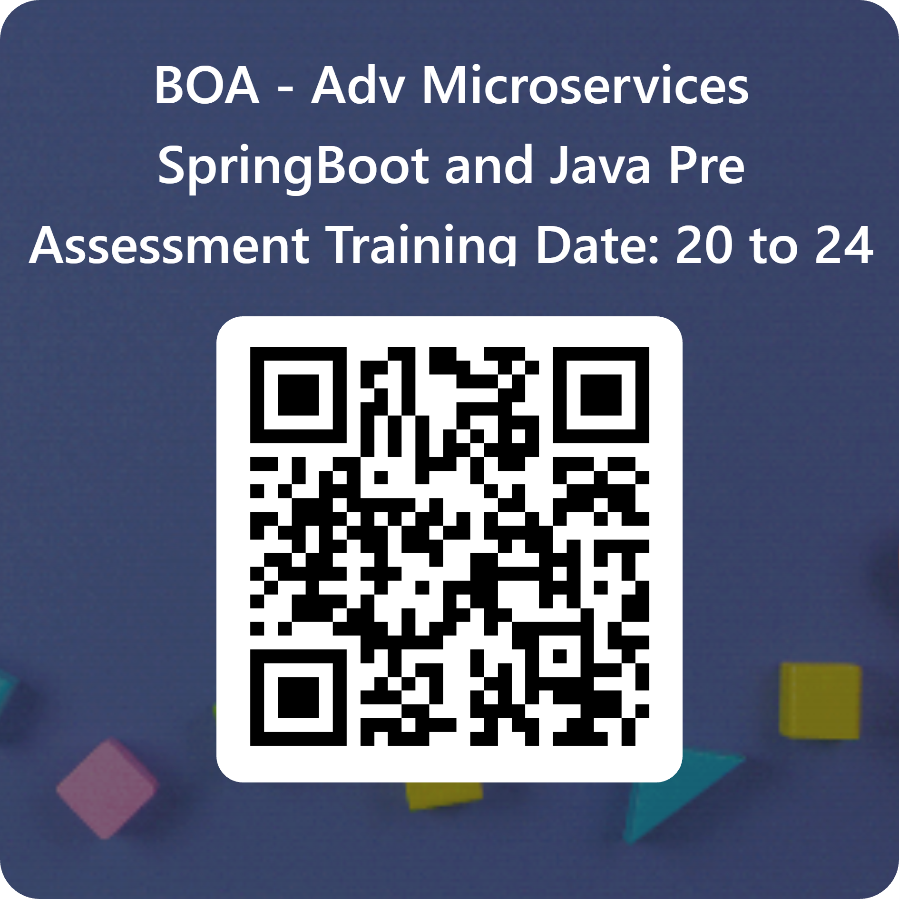

# Spring Boot Microservices Training Repository

## Pre assessment instructions:
- Open the browser from your Cloud Lab Machine
-  Click the link below:
  Pre Assessment Link:  https://forms.office.com/r/M8r74WZdkN

## QR Code for Pre Assessment




# Some Important Docker image run commands
### Run Redis Server with volume
```sh
docker run --rm --name redis -p 6379:6379 -v redis-data:/data -d redis
```
### Stop the above Redis Server
```sh
docker container stop redis
```